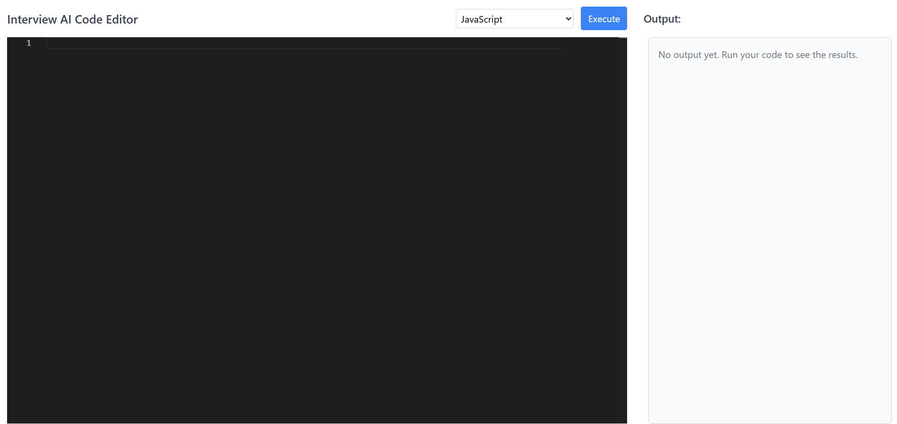

# 🧠 Code Editor for Interview Preparation

A web-based code editor built with **Vue.js** that allows users (especially students) to write, compile, and run code in **JavaScript** and **Python**. This tool is designed to help students prepare for technical interviews with ease, right from their browser.

---

## ✨ Features

- 🌐 Built with Vue 3 & Vite
- 🖥️ Live code editing
- 💻 Compile and run JavaScript and Python code
- 🎯 Perfect for interview preparation
- 🧪 Syntax highlighting
- 🧠 Educational and beginner-friendly UI
- ☁️ Backend APIs (Node.js/NestJS or Python) to execute code securely
- 📱 Responsive design for both desktop and mobile

---

## 📸 Screenshot
---

## 🛠 Tech Stack

| Frontend | Backend | Others        |
|----------|---------|----------------|
| Vue 3    | Node.js / Python | Vite, Axios |
| TailwindCSS |
| vue-prism-editor or Monaco Editor 

---

## 🚀 Getting Started

### Prerequisites

- Node.js v18+
- Python (if using Python backend)
- Yarn / npm / pnpm

### Frontend Setup

    git clone https://github.com/your-username/code-editor.git
    cd code-editor
    npm install
    npm run dev

## 🙌 Follow the Author

Made with ❤️ by **Muaaz Ahmad**  
GitHub: [@muaaz0333](https://github.com/muaaz0333)  
LinkedIn: [linkedin.com/in/MuaazAhmad](https://www.linkedin.com/in/expertfullstackdeveloper/)